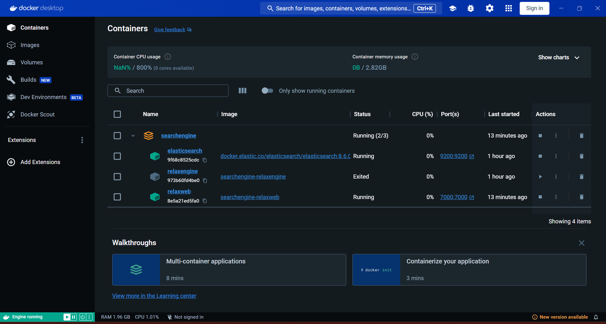
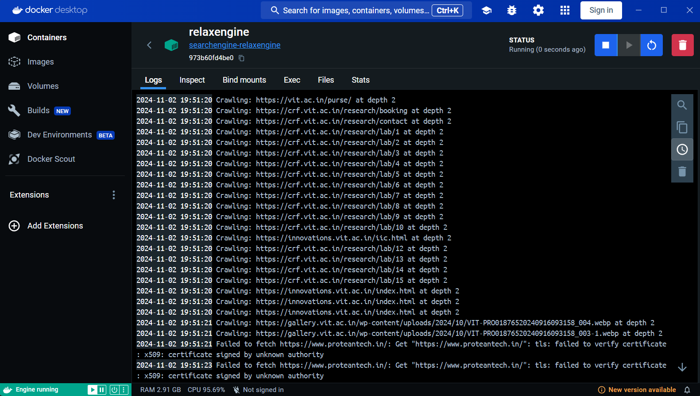
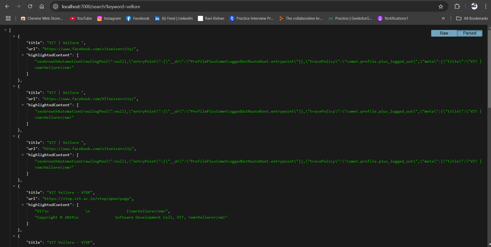

# RelaxSearch

RelaxSearch is a lightweight, demonstration-based search engine project built with Go and Elasticsearch. It comprises two main components:

> Inspire by the Full Document Search in go: [Blog Here](https://medium.com/@ravikishan63392/building-a-high-performance-full-text-search-engine-in-go-f2e4ec63e643)

1. **RelaxEngine**: A web scraper using cron jobs to periodically crawl and index content.
2. **RelaxWeb**: An API server that enables full-text search capabilities on the indexed data.

This project showcases the essentials of a search engine by scraping content from specified URLs and storing them in Elasticsearch, where they are accessible for keyword-based searches.

## Components

### 1. RelaxEngine
- **Function**: A web crawler that scrapes and indexes content from the web. It runs periodically via cron jobs.
- **Technology**: Go and Elasticsearch.
- **Details**: RelaxEngine reads a list of seed URLs, crawls the web starting from these URLs, and indexes the retrieved content in Elasticsearch.

### 2. RelaxWeb
- **Function**: Provides a REST API to search the indexed content.
- **Technology**: Go and Elasticsearch.
- **API Endpoint**: `/search` - Accepts a keyword query and returns relevant content with optional pagination, date filtering, and content highlighting.

## Prerequisites

- **Golang**: v1.16 or higher.
- **Docker**: For containerized deployment.
- **Elasticsearch**: v8.6.0 (configured in Docker Compose).

## Setup and Installation

1. Clone the repository:
   ```bash
   git clone https://github.com/yourusername/RelaxSearch.git
   cd RelaxSearch
   ```

2. Configure `.env` files:
   - **RelaxEngine** and **RelaxWeb** use configuration files for connecting to Elasticsearch and defining scraping parameters.
   - Set up your Elasticsearch credentials in the `.env` files under each service as required.

3. Build and Run with Docker Compose:
   ```bash
   docker-compose up --build
   ```

   - This will start the Elasticsearch service, RelaxEngine (scraping in background), and RelaxWeb (serving the search API on port 7000).





## Usage

### Search API

- **Endpoint**: `GET /search`
- **Parameters**:
  - `keyword` (required): The term to search for.
  - `from` (optional): Pagination start index.
  - `size` (optional): Number of results to return (default: 10).
  - `dateRangeStart` and `dateRangeEnd` (optional): Filter results based on timestamp.

Example using `curl`:
```bash
curl -X GET "http://localhost:7000/search?keyword=example" -H "Authorization: Basic <base64_credentials>"
```



## Project Structure

```
RelaxSearch/
├── relaxengine/           # Crawler and indexing component
│   ├── cmd/               # Main application for crawling
│   ├── config/            # Configuration files
│   └── crawler/           # Crawler logic and utilities
└── relaxweb/              # Search API server
    ├── config/            # Configuration files
    └── search/            # Search functionality and API
```

## Known Issues and Improvements

- **Error handling**: Current error handling can be improved for more robust operation.
- **Scalability**: Limited to demonstration use; suitable for small to medium datasets but you scale with the elasticsearch nodes.

## License

This project is open-source and available under the [MIT License](LICENSE).